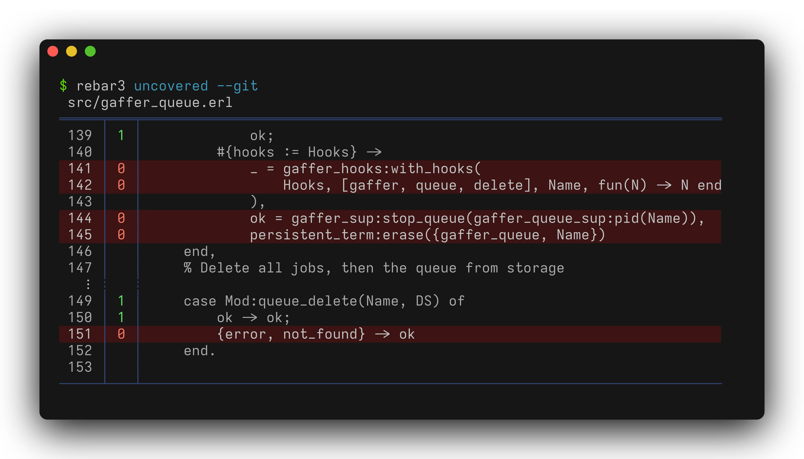

<!-- markdownlint-disable-line MD013 -->
# rebar3_uncovered [![CI Status][ci-img]][ci] [![Minimum Erlang Version][erlang-img]][erlang] [![License][license-img]][license]

[ci]:          https://github.com/eproxus/rebar3_uncovered/actions/workflows/ci.yml?query=branch%3Amain
[ci-img]:      https://img.shields.io/github/actions/workflow/status/eproxus/rebar3_uncovered/ci.yml?label=ci
[erlang]:      https://github.com/eproxus/rebar3_uncovered/blob/main/mise.toml
[erlang-img]:  https://img.shields.io/badge/erlang-28+-blue.svg
[license]:     LICENSE.md
[license-img]: https://img.shields.io/badge/license-MIT-blue.svg

A Rebar 3 plugin that reports on uncovered lines from tests. Run it after
`rebar3 eunit` or `rebar3 ct` to see which lines your tests missed. Use
`--git` to narrow the report to lines changed in the current branch.



A machine-readable format is also available for script / CI / LLM consumption:

```console
$ rebar3 uncovered --git --format=raw --context=0
src/gaffer_queue.erl:141 0             _ = gaffer_hooks:with_hooks(
src/gaffer_queue.erl:142 0                 Hooks, [gaffer, queue, delete], Name, fun(N) -> N end
src/gaffer_queue.erl:144 0             ok = gaffer_sup:stop_queue(gaffer_queue_sup:pid(Name)),
src/gaffer_queue.erl:145 0             persistent_term:erase({gaffer_queue, Name})
src/gaffer_queue.erl:151 0         {error, not_found} -> ok
```

## Usage

```console
rebar3 uncovered [options] [-- path ...]
rebar3 help uncovered
```

Positional arguments after `--` are used as file or directory filters.

### Options

- **`--help`**, **`-h`**

  Show usage information and available options.

- **`--git`**, **`-g`**

  Filter uncovered lines to only those changed in the current git diff. Without
  this flag, all uncovered lines are reported.

- **`--git-scope`**

  Which part of the git diff to consider. Only has effect when `--git` is
  enabled.

    - `all` (default) — both staged and unstaged changes
    - `staged` — only changes added to the index
    - `unstaged` — only working tree changes

- **`--coverage`**

  Which coverage data to use.

    - `aggregate` (default) — combine all test suites
    - `eunit` — only EUnit coverage data
    - `ct` — only Common Test coverage data

- **`--format`**, **`-f`**

  Output format.

    - `human` (default) — color-coded table with line numbers, coverage counts,
      and source context
    - `raw` — one line per uncovered line in a grep-like format suitable for
      scripts, CI, or LLM consumption

- **`--context`**, **`-C`**

  Number of covered lines to show around each uncovered line for context. Only
  applies to `human` format.

    - `<integer>` (default: `2`) — number of context lines to show
    - `0` — show only uncovered lines
    - `all` — show the entire function

- **`--counts`**

  Show how many times each line was executed. Use `--counts false` to hide the
  counts column. Enabled by default.

- **`--color`**

  Color output. Respects the `NO_COLOR` environment variable.

    - `auto` (default) — enable color when output is a terminal
    - `always` — force color on
    - `never` — disable color

## Changelog

See the [Releases](https://github.com/eproxus/rebar3_uncovered/releases) page.

## Code of Conduct

Find this project's code of conduct in [Contributor Covenant Code of Conduct](CODE_OF_CONDUCT.md).

## Contributing

First of all, thank you for contributing with your time and energy.

If you want to request a new feature make sure to [open an issue](https://github.com/eproxus/rebar3_uncovered/issues/new?template=feature_request.md)
so we can discuss it first.

Bug reports and questions are also welcome. If you found a bug, please check that you're using the
latest version first. If you have a question, search the issue database as it might have already
been answered.

Contributions will be subject to the MIT License. You will retain the copyright.

For more information check out [CONTRIBUTING.md](CONTRIBUTING.md).

## Security

This project's security policy is made explicit in [SECURITY.md](SECURITY.md).

## Conventions

### Versions

This project adheres to
[Semantic Versioning](https://semver.org/spec/v2.0.0.html).

### License

This project uses the [MIT License](LICENSE.md).
